# Authors: 
* [Federica Botta](https://www.linkedin.com/in/federica-botta-8629391b3/) 
* [Simone Colombara](https://www.linkedin.com/in/simone-colombara-a4a430167/)
* [Michele Di Sabato](https://www.linkedin.com/in/michele-di-sabato/)

# Covid 19:
In this project we use RNNs to predict the weekly values of four features related to the COVID 19 pandemic in Sicily, Lombardy and Lazio (IT).

Each function is explained in the [Code](#code-and-structure-of-the-repository) section. Note that **results are shown in [prevision_covid.ipynb](prevision_covid.ipynb)**, which contains important information about which parameters to modify in order to update and re-train the models. The rest of the scripts are used to collect and pre-process the data and post-process the results.

## Dataset:
The source of the dataset is the [GitHub repository](https://github.com/pcm-dpc/COVID-19) of the [Protezione Civile](https://en.wikipedia.org/wiki/Protezione_Civile), specifically [this link](https://github.com/pcm-dpc/COVID-19/tree/master/dati-province). We focused on the following features:
1. <em>nuovi_positivi</em>: **daily** amount of current positive cases (totale_casi current day - totale_casi previous day)
2. <em>totale_ospedalizzati</em>: total **cumulative** hospitalised patients
3. <em>dimessi_guariti</em>:**daily** amount of recovered
4. <em>deceduti</em>: total **cumulative** number of deceased

We only focus on:
1. Sicily
2. Lombardy
3. Lazio

## Goal:
The goal is twofold:
1. set up an **automatic tool** that accesses, updates and organizes the COVID-19 epidemiological data of Italy (on a regional basis) as explained in the [Dataset](#dataset) section
2. **predict** four variables regarding the COVID19 pandemic situation in three regions in Italy

## Scraping:
To download automatically the data from the [repository](https://github.com/pcm-dpc/COVID-19) we used the libraries [`requests`](https://pypi.org/project/requests/) and [`bs4`](https://pypi.org/project/beautifulsoup4/). To minimize scraping time, the function [`update_files.csv`]() checks for new additions to the repository, to avoid dowloading files which are already present in the local folder. It's best to periodically download the entire folder from scratch, since sometimes the maintainers of the repository will change past csv files to correct mistakes or wrongly reported data.

## Data preprocessing:
This step consists in preparing the scraped dataset for the Recurrent Neural Network. 

### Data cleaning
We noticed that data about the first weeks of the pandemic was quite different from the current trend. Moreoever, in the first few weeks of 2020 the tracking protocol of the pandemic was at its initial stages, so possible errors in the registration of some data might have occurred. For these two reasons, we discarded the three weeks after the first available date, which was the 24th of January 2020.

### Rescaling
We rescaled all features using [`MinMaxScaler`](https://scikit-learn.org/stable/modules/generated/sklearn.preprocessing.MinMaxScaler.html). This type of scaling also reduces almost two zeros the initial values of the features: this is an advantage, since the current trend of the features under study seem
to be very different when compared to their values during the first months of the pandemic.

### Build samples
From now on when we use the term *sample* to define one single input of the RNN. A sample is constucted by taking a certain number of days (this parameter is called **`window`**) to predict the following ones (the number of days to predict is called **`telescope`**). In our code we tried with `window` equal to 7, 14 and 21. An example of a sample is:

| 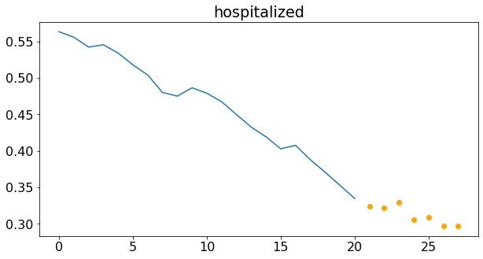 |
|:--:|
| Number of hospitalized in Lombardy with window = 21. The orange dots are the number of hospitalized in the prediction time window.|

Another important parameter is `stride`, which indicates the number of days between two subsequent samples. For example, `stride = window` means that the samples are non-overlapping. In our code, we used `stride` equal to one week.

## Model:
We used [LSTM](https://colah.github.io/posts/2015-08-Understanding-LSTMs/) networks as building blocks for our model, for their well known properties.

### Approaches
Three approaches are possible:
|Model name |Description |Advantages |Disadvantages 
|-----|------------|-----------|-------------|
|**many-to-many** | forecast all four features, using all four features | 1. allows us to take into account the correlation among the variables | 1. to follow this approach one should transform all the features either in daily or in cumulative form, otherwise the network’s forecast would be highly influenced by some features and completely miss the others <br/> 2. requires to have a powerful model
|**many-to-one** | forecast one single feature at a time, using all four categories | 1. allows us to take into account the correlation among the variables <br/> 2. should require a less powerful model, since it would predict only one scalar (not a vector as in the *many-to-many* approach) | 1. model design is not trivial <br/> 2. for our goal (7-days-ahead-prediction) is correlation really *that* important?
|**one-to-many** | forecast one single feature at a time, considering only its past values | 1. the model is much more lightweight than the other two | 1. each feature is predicted independently from the others (not necessarily a limitation)

For each of this choices, we have two possible frameworks:
- **one-shot**: predict all 7 days at once.
- **autoregressive**: use the `window` past days to predict only one, then include this prediction in the training set, roll the training window and predict the second day. Repeat this "rolling prediction" procedure until
all 7 days have been predicted.

We implemented all the three methodologies, but we decided to use the <u>**one-to-one approach with a one-shot prediction**</u> as our final model for the following reasons:
1. <u>computational cost:</u> the model is trained with less computational cost;
2. <u>error growth:</u> the many-to-many and many-to-one approach require the dataset to be composed of all cumulative features, but since we need to forecast also some daily quantities, at the testing time we need to convert the
daily features back to daily values. This step enlarges significantly the errors made on the cumulative
predictions;
3. <u>effect of the correlation:</u> while it is true that the selected features are correlated, the effects of this correlation seem to be evident in time periods longer than one week, so they would likely not influence nor be useful for our prediction
(which involves only seven days).

### Model arichitecture
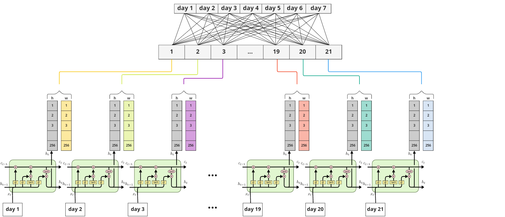 |
 :-------------------------:| 
 Qualitative model structure (`Reshape` and `Dropout` layers have been removed to avoid overcomplicating the image)

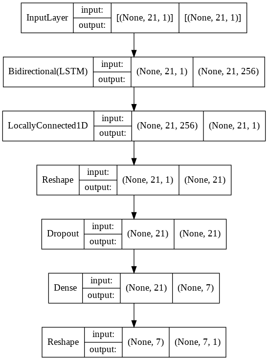  |  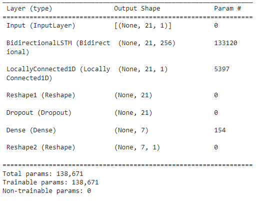
:-------------------------:|:-------------------------:
Model structure             |  Technical plot

## Predictions:
Here are some plots that showcase the predictive ability of our model:
* hospitalized in Lombardy:
<table>
  <tr>
    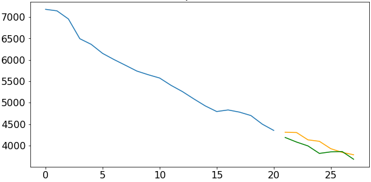
    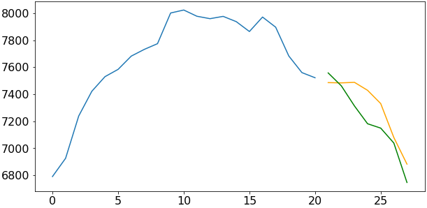
  </tr>
  
  <tr>
    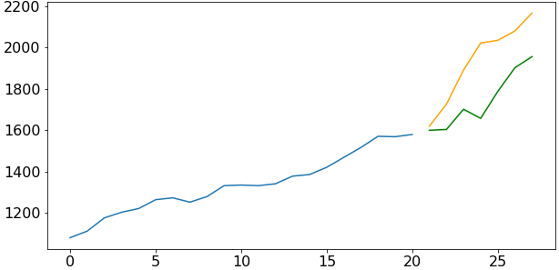
    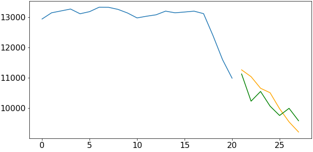
  </tr>
</table>

* infected in Lazio:
<table>
  <tr>
    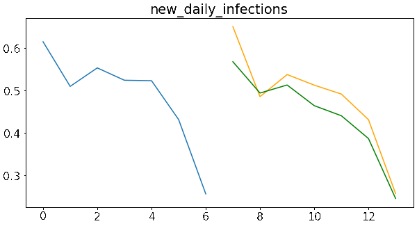
    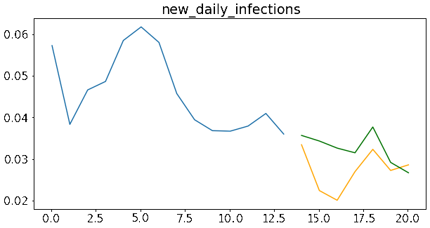
  </tr>
  
  <tr>
  <center>
    
  </center>
  </tr>
</table>

* deceased, hospitalized, infected and recovered in Sicily:
<table>
  <tr>
    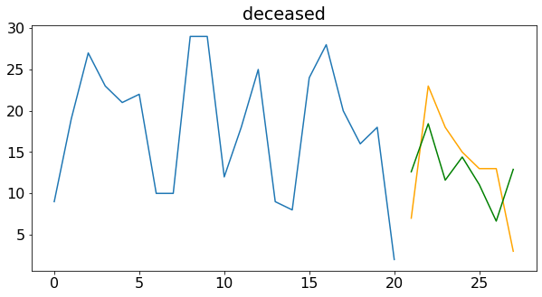
    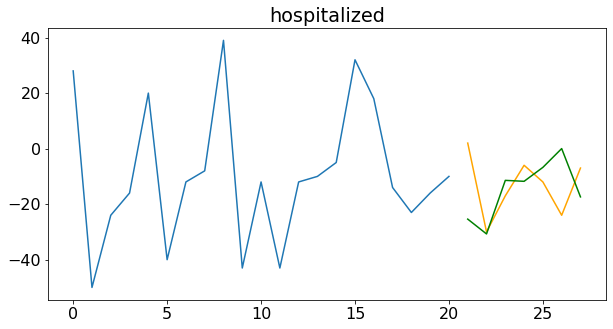
  </tr>
  
  <tr>
    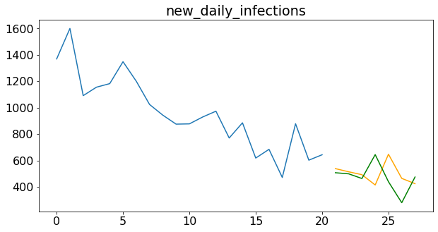
    
  </tr>
</table>

## Code and structure of the repository: 
```
covid-19/
│
├── regional_data_covid/            # dataset
│   ├── ...
├── create_dataframes.py/           # used to transform data into pandas.DataFrame
├── prevision_covid.ipynb/          # contains model and data pre-processing
├── README.md/                      # 
├── scrape.py/                      # used to scrape the repository containing the data
├── scraper.py/                     # used to scrape the repository containing the data
├── update_files.py/                # used to update the local folder "regional_data_covid"
├── util.py/                        # contains useful functions used in "prevision_covid.ipynb"
├── Lombardia_models/               # pre-trained models for Lombardy
│   ├── deceased_7
|   |── deceased_14
|   |── deceased_21
|   |── hospitalized_7
|   |── hospitalized_14
|   |── hospitalized_21
|   |── new_daily_infections_7
|   |── new_daily_infections_14
|   |── new_daily_infections_21
|   |── recovered_7
|   |── recovered_14
|   |── recovered_21
├── Lazio_models/                   # pre-trained models for Lazio
│   ├── deceased_7  
|   |── deceased_14
|   |── deceased_21
|   |── hospitalized_7
|   |── hospitalized_14
|   |── hospitalized_21
|   |── new_daily_infections_7
|   |── new_daily_infections_14
|   |── new_daily_infections_21
|   |── recovered_7
|   |── recovered_14
|   |── recovered_21
├── Sicilia_models/                 # pre-trained models for Sicily
│   ├── deceased_7
|   |── deceased_14
|   |── deceased_21
|   |── hospitalized_7
|   |── hospitalized_14
|   |── hospitalized_21
|   |── new_daily_infections_7
|   |── new_daily_infections_14
|   |── new_daily_infections_21
|   |── recovered_7
|   |── recovered_14
|   |── recovered_21
├── readme_images/                  # plots for "README.md"
│   ├── deceased_sicilia.png
│   ├── hosp_1.PNG
│   ├── hosp_2.PNG
│   ├── hosp_3.PNG
│   ├── hosp_4.PNG
│   ├── hospitalized.png
│   ├── infect_lazio_14.png
│   ├── infect_lazio_21.png
│   ├── infect_lazio_7.png
│   ├── model2.png
│   ├── model3.PNG
│   ├── model_plot.PNG
│   ├── new_daily_infections.png
│   ├── recovered sicilia.png
│   ├── sample.png
```

Note that **results are shown in [prevision_covid.ipynb](prevision_covid.ipynb)**, which contains important information about which parameters to modify in order to update and re-train the models. The rest of the scripts are used to collect and pre-process the data and post-process the results.


